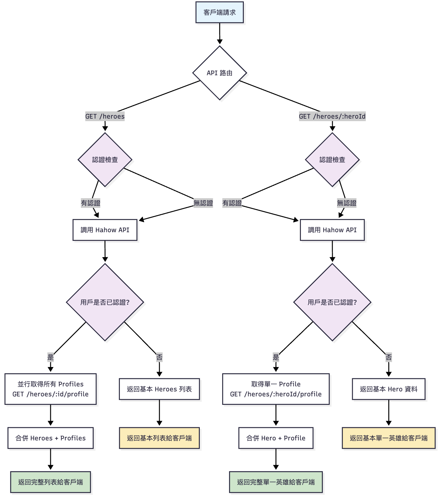

# Hero Backend API Server
基於 Node.js + TypeScript 的 RESTful API 服務

## 目錄
- [快速開始](#快速開始)
- [系統架構設計](#系統架構設計)
- [API 規格說明](#api-規格說明)
- [技術選型與決策](#技術選型與決策)
- [使用註解時機](#使用註解時機)
- [遇到的困難與解決方法](#遇到的困難與解決方法)

---

## 快速開始

### Docker 運行

```bash
# 1. Clone 專案
git clone https://github.com/diverwil1995/hero-backend.git
cd hero-backend

# 2. 設定環境變數
cp .env.example .env

# 3. 建置並運行
docker build -t hero-backend .
docker run -d \
  --name hero-backend \
  -p 3000:3000 \
  --env-file .env \
  hero-backend

# 4. 驗證服務
curl http://localhost:3000/health

# 5. 停止服務
docker stop hero-backend && docker rm hero-backend
```

### 快速 API 測試

```bash
# 取得 Hero 列表（認證成功）
curl -H "Accept: application/json" -H "Content-Type: application/json" -H "Name: hahow" -H "Password: rocks" -X GET http://localhost:3000/heroes

# 取得 Hero 列表（認證失敗）
curl -H "Accept: application/json" -H "Content-Type: application/json" -H "Name: wrong" -H "Password: wrong" -X GET http://localhost:3000/heroes

# 取得單一 Hero（認證成功）
curl -H "Accept: application/json" -H "Content-Type: application/json" -H "Name: hahow" -H "Password: rocks" -X GET http://localhost:3000/heroes/1

# 取得單一 Hero（認證失敗）
curl -H "Accept: application/json" -H "Content-Type: application/json" -H "Name: wrong" -H "Password: wrong" -X GET http://localhost:3000/heroes/1
```

---
## 系統架構設計
### 專案目錄架構

```
src/
├── app.ts                          # 應用程式主體配置
├── index.ts                        # 入口點
├── server.ts                       # 伺服器啟動邏輯
├── config.ts                       # 環境變數管理
├── clients/                        # 外部服務客戶端
│   ├── hero.client.ts
│   └── hero.client.test.ts
├── controllers/                    # 路由控制器
│   └── hero.controller.ts
│   └── hero.controller.test.ts
└── middleware/                     # 中介軟體
    ├── auth.middleware.ts
    └── error.handler.ts
```
### 分層架構邏輯

| 層級 | 職責 | 主要檔案 | 設計原則 |
|------|------|----------|----------|
| **Entry Point** | 應用程式啟動 | `index.ts`, `server.ts` | 環境初始化、服務啟動 |
| **Application** | 應用程式配置 | `app.ts`, `config.ts` | 中間件註冊、路由設定 |
| **Controller** | 路由與業務邏輯 | `hero.controller.ts` | 請求處理、回應格式化 |
| **Client** | 外部服務整合 | `hero.client.ts` | API 呼叫、資料驗證 |
| **Middleware** | 橫切關注點 | `auth.middleware.ts`, `error.handler.ts` | 認證、錯誤處理 |
| **Test** | 單元測試 | `hero.client.test.ts`, `hero.controller.test.ts` | 隔離測試、依賴模擬 |


### 資料流程設計


---

## API 規格說明

### 端點總覽

| 方法 | 路徑 | 描述 | 認證需求 | 回應差異 |
|------|------|------|----------|----------|
| `GET` | `/health` | 健康檢查 | 無 | 服務狀態 |
| `GET` | `/heroes` | Hero 列表 | 可選 | 認證後包含 profile |
| `GET` | `/heroes/:heroId` | 單一 Hero | 可選 | 認證後包含 profile |

### 設計考量
- 認證失敗時採用降級策略，不返回錯誤而是提供公開資料
- 當上游 API 返回無效回應時，統一回傳 502 錯誤

---

## 技術選型與決策

### 核心框架選擇

#### **Node.js 18+ 與 TypeScript 5.8.3**
**選擇理由：** 專案指定使用 Node.js，好上手且社群資源豐富。TypeScript 雖然增加學習成本，但提供型別安全和更好的開發體驗。

**功能理解：** Node.js 採用事件驅動、非阻塞 I/O 模型，適合處理高併發 API 請求。TypeScript 在編譯時期發現型別錯誤，減少執行時期的 bug。

#### **Express 5.1.0**
**選擇理由：** 生態系統最成熟，學習資源豐富。

**功能理解：** Express 是極簡的 Web 應用框架，提供路由系統、中間件機制、模板引擎支援等核心功能。

### HTTP 客戶端與資料驗證

#### **axios 1.10.0**
**選擇理由：** API 設計使用上很直觀，錯誤處理完善。

**功能理解：** axios 提供統一的 API 介面進行 HTTP 請求，支援 Promise，可設定預設配置（如 base URL、headers），語法比原生 fetch 更簡潔直觀。

#### **yup 1.6.1**
**選擇理由：** Schema-Based 驗證庫需要，操作好理解。

**功能理解：** yup 透過 Schema 定義資料結構和驗證規則，使用 InferType 自動生成對應的 TypeScript 型別，確保資料驗證與型別定義同步。

### 開發工具與測試

#### **tsx 4.20.3**
**功能理解：** 直接執行 TypeScript 檔案，內部使用 esbuild 快速編譯，支援 watch 模式熱重載。

#### **Jest 30.0.4 + supertest 7.1.1 + axios-mock-adapter 2.1.0**
**功能理解：** Jest 提供完整測試框架功能，supertest 專門測試 HTTP 端點，axios-mock-adapter 模擬 axios 請求。

#### **ESLint 8.0.0 + Prettier 3.0.0**
**功能理解：** ESLint 進行靜態程式碼分析和品質檢查，Prettier 統一程式碼格式。

### 安全與中間件

#### **helmet 8.1.0**
**功能理解：** 自動設定多種 HTTP 安全標頭，包含 CSP、X-Frame-Options、HSTS 等，防護常見網路攻擊。

#### **cors 2.8.5**
**功能理解：** 處理跨域請求的中間件，設定允許的來源、方法、標頭，確保前端能正常呼叫 API。

#### **dotenv 17.0.1**
**功能理解：** 載入 `.env` 檔案中的環境變數到 `process.env`，實現設定與程式碼分離。

### 選型決策考量

1. **好上手優先**：選擇文件完整、社群活躍的主流技術
2. **生態系統成熟度**：偏好 GitHub stars 較多、維護活躍的專案
3. **TypeScript 友善**：所有選擇都有良好的 TypeScript 支援
4. **安全性考量**：內建安全防護，減少手動設定的錯誤風險
---

## 使用註解時機
有些上游 API 存在設計缺陷，即使發生錯誤也可能返回 HTTP 200 狀態碼，但在 response body 中包含錯誤訊息。例如：
* 正常成功：200 OK + "OK"
* 異常情況：200 OK + {code: 1000, message: "Backend Error"}
* 認證失敗：401 Unauthorized

這時候我就會需要註解說明為什麼這樣實現：

```
  async auth(name: string, password: string): Promise<boolean> {
    const authData = { name, password };
    const authUrl = `${this.baseUrl}/auth`;
    try {
      const authResponse = await this.axiosInstance.post(authUrl, authData, {
        headers: {
          "Content-Type": "application/json",
        },
      });

      // 上游 API 有時會返回 HTTP 200 但內容為錯誤訊息 {code: 1000, message: "Backend Error"}
      // 因此需要透過 schema validation 來檢查回應資料結構的正確性
      // 如果資料結構不符預期，將拋出 ValidationError 進入 catch 區塊處理
      const validatedResponse = await getAuthDataSchema.validate(
        authResponse.data,
      );

      return validatedResponse === "OK";
    } catch (error: any) {
      // 區分真正的 401 認證失敗與偽裝成 200 的後端錯誤
      if (error?.response?.status === 401) {
        return false;
      }
      throw new HeroClientError(error.toString());
    }
  }
```

## 遇到的困難與解決方法

### 問題一：上游 API 錯誤回應不一致

#### 問題描述
上游 API 的錯誤處理機制不符合 RESTful 標準，即使發生後端錯誤也可能返回 HTTP 200 狀態碼，導致錯誤難以正確識別和處理。

#### 具體狀況
- 正常成功：`200 OK` + `"OK"`
- 後端異常：`200 OK` + `{code: 1000, message: "backend error"}`
- 認證失敗：`401 Unauthorized`

#### 解決方法
透過 schema validation 驗證回應資料結構，將結構異常的回應拋出 ValidationError，在 catch 區塊中區分處理不同類型的錯誤。

```typescript
const validatedResponse = await getAuthDataSchema.validate(authResponse.data);
```

### 問題二：Hero List 與 Profile 的 N+1 查詢效能問題

#### 問題描述
需要取得英雄列表並根據使用者權限附加詳細資料，若逐一請求會造成 N+1 查詢問題，嚴重影響 API 回應時間。

#### 原始作法問題
```
1 次 getHeroList() + N 次 getProfile() = N+1 次請求
若有 20 個英雄，總共需要 21 次 HTTP 請求
```

#### 解決方法
使用 `Promise.all` 並行處理所有 profile 請求，將序列請求改為並行執行，除了降低請求回應時間、資源開銷，也提高可讀性與可維護性。

```typescript
router.get("/", authMiddleware(heroClient), async (req: HeroRequest, res: Response) => {
  const hasPermission = req.locals?.hasPermission;
  const heroes = await heroClient.getHeroList();

  // 解決方案：使用 Promise.all 並行處理多個 profile 請求
  const profilePromises = [];
  let profiles: ProfileResponse[] | undefined;
  
  if (hasPermission) {
    // 建立所有 profile 請求的 Promise 陣列
    for (const hero of heroes) {
      const profilePromise = heroClient.getProfile(hero.id);
      profilePromises.push(profilePromise);
    }
    // 並行等待所有 profile 請求完成
    profiles = await Promise.all(profilePromises);
  }

  // 組合 hero 與 profile 資料
  const heroResult = [];
  if (profiles) {
    for (let i = 0; i < heroes.length; i++) {
      const hero = heroes[i];
      const heroWithProfile: AuthorizedHero = {
        id: hero.id,
        name: hero.name,
        image: hero.image,
        profile: profiles[i], // 按索引對應
      };
      heroResult.push(heroWithProfile);
    }
  } else {
    // 無權限時僅返回基本資訊
    for (const hero of heroes) {
      const basicHero: HeroInfo = {
        id: hero.id,
        name: hero.name,
        image: hero.image,
      };
      heroResult.push(basicHero);
    }
  }

  res.json({ heroes: heroResult });
});
```

#### 